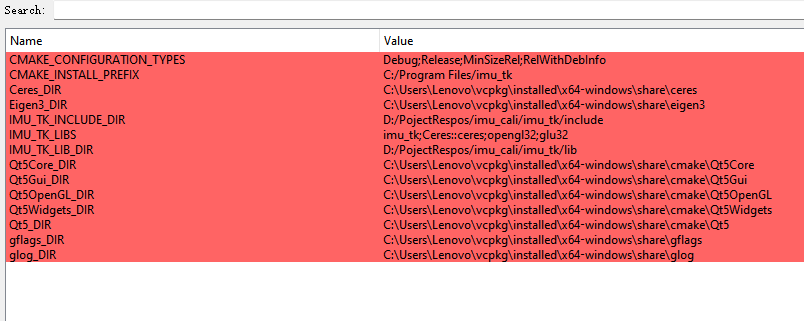

## Windows Building Step

### 1 
1. modeify Cmakelist.txt
   ```c++
        project(imu_tk)

      cmake_minimum_required (VERSION 3.0) 
      cmake_policy(SET CMP0015 NEW)

      if ("${CMAKE_BUILD_TYPE}" STREQUAL "")
        set(CMAKE_BUILD_TYPE "Release")
      endif()

      if(NOT DEFINED BUILD_IMU_TK_EXAMPLES)
        set(BUILD_IMU_TK_EXAMPLES "ON")
      endif(NOT DEFINED BUILD_IMU_TK_EXAMPLES)

      find_package(Boost REQUIRED)  
      find_package(Eigen3 REQUIRED)
      find_package(Ceres REQUIRED)

      include_directories(./include
                          /usr/include
                          ${Boost_INCLUDE_DIRS}
                          ${EIGEN_INCLUDE_DIR}
                          ${CERES_INCLUDE_DIRS})

      #Vis3D
      find_package(Qt5 COMPONENTS Core Gui OpenGL REQUIRED )
      find_package(OpenGL REQUIRED)
      # find_package(GLUT REQUIRED)

      include_directories( ${OPENGL_INCLUDE_DIRS}  
                           ${GLUT_INCLUDE_DIRS}
                           ${CMAKE_CURRENT_BINARY_DIR} )

      set(IMU_TK_VIS_EXTRA_SOURCES 
          ./src/vis_extra/gl_camera.cpp 
          ./src/vis_extra/opengl_3d_scene.cpp )
      set(IMU_TK_VIS_EXTRA_HEADERS
          ./include/imu_tk/vis_extra/opengl_3d_scene.h )

      qt5_wrap_cpp(IMU_TK_VIS_EXTRA_HEADERS_MOC ${IMU_TK_VIS_EXTRA_HEADERS})

      # include(${QT_USE_FILE})
      add_definitions(${QT_DEFINITIONS})

      aux_source_directory( ./src IMU_TK_CORE_SRC )
      set( IMU_TK_SRC ${IMU_TK_CORE_SRC} ${IMU_TK_VIS_EXTRA_HEADERS_MOC} ${IMU_TK_VIS_EXTRA_SOURCES} )

      add_library(imu_tk ${IMU_TK_SRC})
      set_target_properties(imu_tk PROPERTIES ARCHIVE_OUTPUT_DIRECTORY ${PROJECT_SOURCE_DIR}/lib)

      set (IMU_TK_INCLUDE_DIR ${CMAKE_CURRENT_SOURCE_DIR}/include CACHE STRING "imu_tk include     directories")
      set (IMU_TK_LIB_DIR ${CMAKE_CURRENT_SOURCE_DIR}/lib CACHE STRING "imu_tk libraries directories")
      set (IMU_TK_LIBS imu_tk ${CERES_LIBRARIES} ${QT_LIBRARIES} ${OPENGL_LIBRARIES} ${GLUT_LIBRARY} 
           CACHE STRING "imu_tk libraries")

      message( "${IMU_TK_LIBS}" )

      if( BUILD_IMU_TK_EXAMPLES )

      add_executable(test_imu_calib apps/test_imu_calib.cpp)
      target_link_libraries( test_imu_calib ${IMU_TK_LIBS})
      set_target_properties( test_imu_calib PROPERTIES RUNTIME_OUTPUT_DIRECTORY ${PROJECT_SOURCE_DIR}/      bin)


      add_executable(test_integration apps/test_integration.cpp)
      target_link_libraries( test_integration ${IMU_TK_LIBS})

      set_target_properties( test_integration PROPERTIES RUNTIME_OUTPUT_DIRECTORY $    {PROJECT_SOURCE_DIR}/bin)

      endif( BUILD_IMU_TK_EXAMPLES )
   ```

2. `install  vcpkg`
   1. vcpkg install eigen3
   2. vcpkg install ceres
   3. vcpkg install opengl
3. Cmake GUI build 
   1. click Configure and apperence  Error in cmake
      1. common dir not set errors 
      2. set as  
      3. Generate Button click , ignore errors
      4. Open Project
4. build in vs
    
      1. 设置里面增加宏定义  GLOG_NO_ABBREVIATED_SEVERITIES 
      2. 找不到 gflags::gflags.lib  
         1. 改成 gflags.lib
         2. vckpg 的lib目录加入到工程的库附加目录
      3. 自己导入 Qt5的对应目录 
      4. filters.cpp 模板函数偏特性 去掉参数的默认值
      5.  由于 Windows.h 的加入 ， `std::numeric_limits< float >::max()` ` 改成 (std::numeric_limits< float >::max)()`