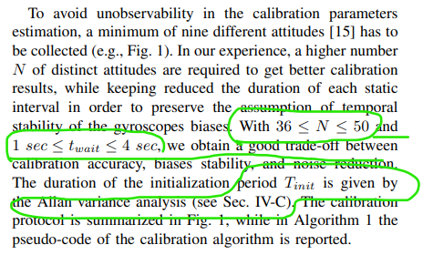

## IMU_TK Read Note
### References:
Papers Describing the Approach:
D. Tedaldi, A. Pretto and E. Menegatti, "A Robust and Easy to Implement Method for IMU Calibration without External Equipments". In: Proceedings of the IEEE International Conference on Robotics and Automation (ICRA 2014), May 31 - June 7, 2014 Hong Kong, China, Page(s): 3042 - 3049 ([PDF](https://www.researchgate.net/publication/273383944_A_robust_and_easy_to_implement_method_for_IMU_calibration_without_external_equipments))
### Ideals
1. 首先标定 acc
2. 根据acc 再标定 陀螺仪 gyroscope
   1. 陀螺仪输出的是 xyz 的 角速度

### 流程

1. 首先打开 imu 静止 static_time 不动 采集数据  `acc` & `gyro` 数据
2. 每间隔一次时间 转动imu，然后静止
3. 往复多次采集

### 误差模型
* 理想IMU acc 与 gyro 的xyz3轴是正交的 `orthogonal`
* 实际由于系统的问题 两个坐标系通常都是不正交的 `non-orthogonal`
* 预定义 AF AOF 
  1. AOF 理想状态先的Frame
  2. AOF 的 x轴与AF的x轴重合
  3. AOF 的 y 轴 在 AF x-o-y 的平面内
  4. BF 为 body frame imu外壳的坐标系，它是正交的
  5.  基本公式 
  6.  图解
  7.  算法 使用BF 与 AOF 完全重合，对于`acc` 且通过第2，3点的定义，我们可以简化eq1公式的矩阵 左下角都为0   
  8.  acc gyros的误差模型就为  两组T K b 为我们要求的参数
      1. 对于 acc T参数左下角为0  因为我们任务 body frame 与AF 是只有纯旋转的
      2. 对于 gyro 则不是 ，因为我们是按照acc对齐的，所以gyro的T参数有6个
  9. 构建最小二乘法
     1.  通过已知的重力加速度 可以求出 $T^a,K^a$  
     2.  再带入 eq6 右侧得到标定后的 acc
     3.  根据转动时候的 时间 $dt$ 对 acc进行积分 得到旋转矩阵
     4.  通过计算 g0 旋转后的 $g' - g $ 来优化求出参数

### 其他：
* 要注意init静止时间，这部分的方差用于划分区间的依据
* 论文中提及的注意事项 